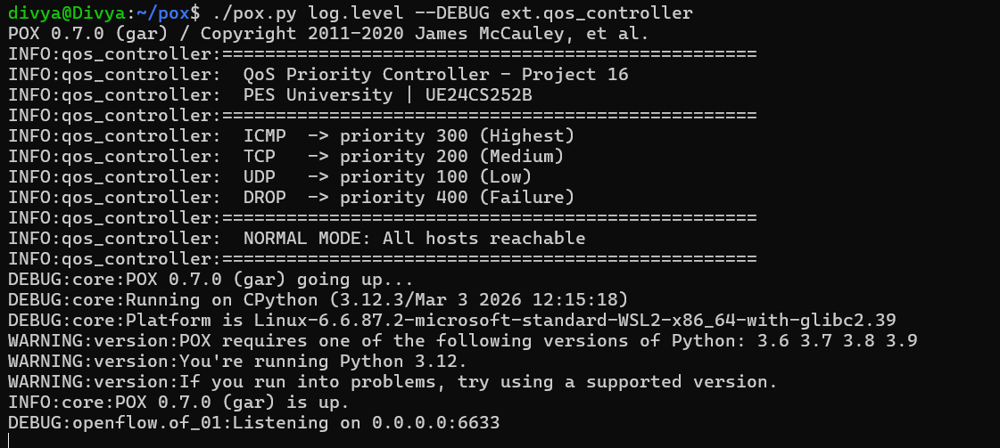
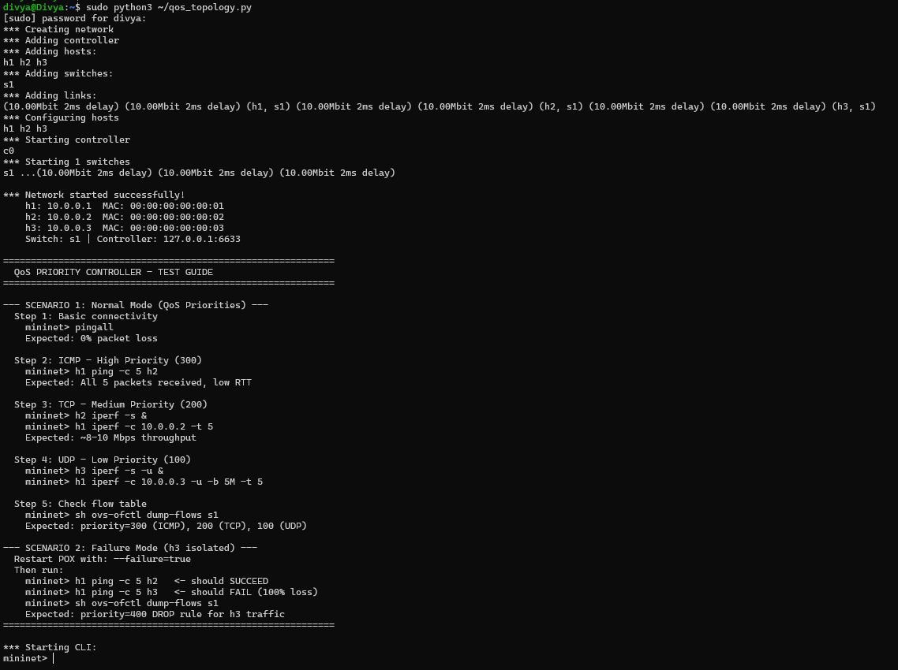
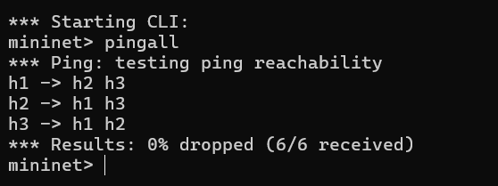
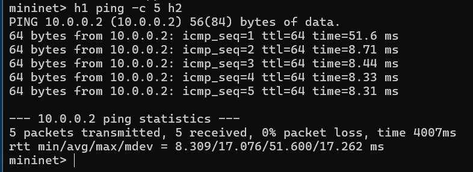
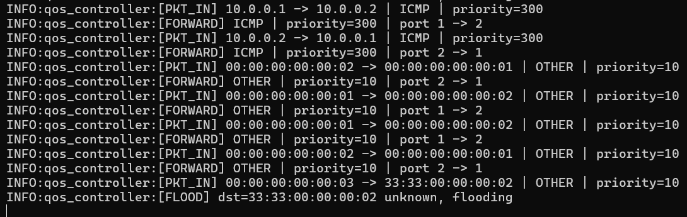
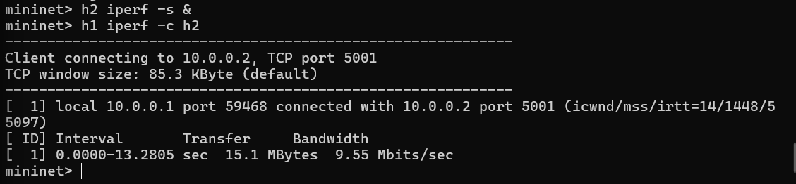
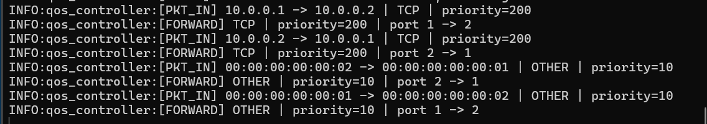
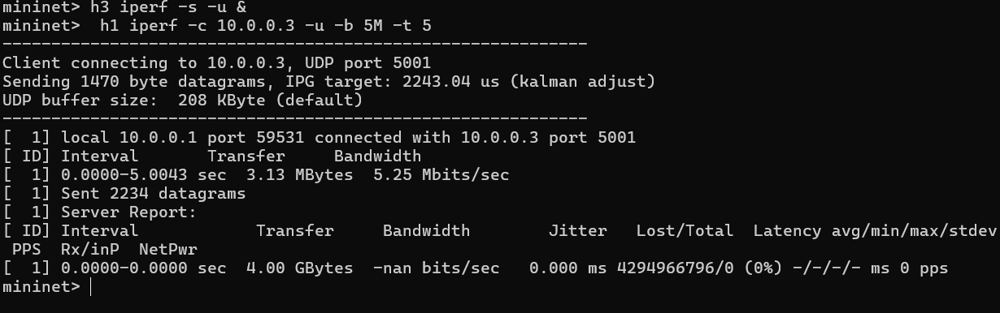
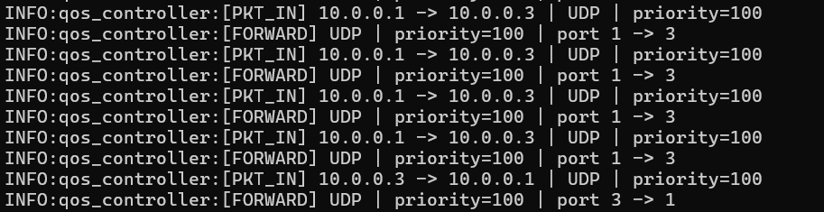
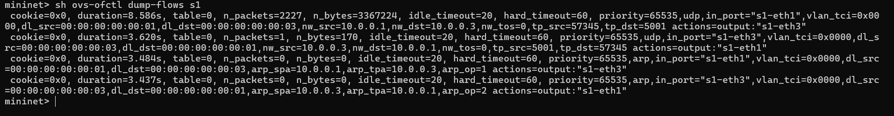

# SDN QoS Priority Controller (Project 16)

## 🎓 Course

UE24CS252B - Computer Networks
PES University

---

## 📌 Problem Statement

Implement an SDN-based QoS controller using POX to prioritize different traffic types and demonstrate both normal and failure scenarios.

---

## 🎯 Objective

* Classify traffic based on protocol (ICMP, TCP, UDP)
* Assign priority levels using OpenFlow rules
* Demonstrate QoS behavior using performance testing
* Simulate failure conditions using drop rules

---

## 🌐 Network Topology

```
        h1 (10.0.0.1)
              |
        h2 (10.0.0.2)
              |
            [ s1 ]
              |
        h3 (10.0.0.3)

        POX Controller (127.0.0.1:6633)
```

* Single switch (s1)
* Three hosts (h1, h2, h3)
* Remote POX controller
* OpenFlow protocol used for rule installation

---

## 🧠 QoS Policy

| Traffic Type   | Priority | Description                    |
| -------------- | -------- | ------------------------------ |
| ICMP           | 300      | Highest priority (low latency) |
| TCP            | 200      | Medium priority                |
| UDP            | 100      | Lowest priority                |
| DROP (Failure) | 400      | Blocks selected traffic        |

---

## ⚙️ Setup Instructions

### 🔹 Step 1: Run Controller (Normal Mode)

```bash
cd ~/pox
./pox.py log.level --DEBUG ext.qos_controller
```

### 🔹 Step 2: Run Controller (Failure Mode)

```bash
./pox.py log.level --DEBUG ext.qos_controller --failure=true
```

### 🔹 Step 3: Run Mininet Topology

```bash
sudo mn -c
sudo python3 qos_topology.py
```

---

## 🧪 Scenario 1: Normal Mode (QoS Behavior)

### ✅ Connectivity Test

```bash
pingall
```

### 📶 ICMP (High Priority)

```bash
h1 ping -c 5 h2
```

### 📊 TCP (Medium Priority)

```bash
h2 iperf -s &
h1 iperf -c 10.0.0.2 -t 5
```

### 📉 UDP (Low Priority)

```bash
h3 iperf -s -u &
h1 iperf -c 10.0.0.3 -u -b 5M -t 5
```

### 🔍 Flow Table

```bash
sh ovs-ofctl dump-flows s1
```

---

## ❌ Scenario 2: Failure Mode

### 🔹 Run controller with failure enabled

```bash
./pox.py log.level --DEBUG ext.qos_controller --failure=true
```

### 🔹 Test connectivity

```bash
h1 ping -c 5 h2   # SUCCESS
h1 ping -c 5 h3   # FAIL (100% loss)
```

### 🔹 Flow Table

```bash
sh ovs-ofctl dump-flows s1
```

Expected:

* DROP rule with priority 400

---
## 📸 Screenshots

### 🔹 Controller Running


---

### 🔹 Network Topology


---

### 🔹 Connectivity Test (pingall)


---

## 🚦 ICMP (High Priority - 300)

### Mininet Output


### Controller Logs


---

## 🚦 TCP (Medium Priority - 200)

### Mininet Output


### Controller Logs


---

## 🚦 UDP (Low Priority - 100)

### Mininet Output


### Controller Logs


---

### 🔹 Flow Table (Normal Mode)


---

### ❌ Failure Scenario (Host h3 Blocked)


## 📊 Results

* ICMP traffic shows lowest latency
* TCP provides stable throughput
* UDP experiences lower priority handling
* Failure mode successfully blocks selected host traffic

---

## 🧠 Concepts Used

* Software Defined Networking (SDN)
* OpenFlow match-action rules
* PacketIn event handling
* Flow table management
* QoS traffic prioritization
* Failure simulation using drop rules

---

## 🏁 Conclusion

The project successfully demonstrates QoS implementation using SDN.
Traffic prioritization is achieved through OpenFlow rules, and failure scenarios are effectively simulated using drop rules, validating controller behavior.

---

